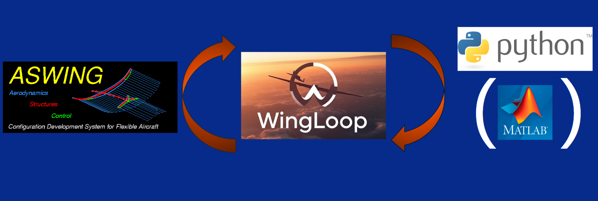

## ASWING Documentation
### Introduction
[ASWING](https://web.mit.edu/drela/Public/web/aswing/) is a computational tool developed at MIT by **Mark Drela** for the **aerodynamic, structural, and control analysis of aircraft**.  
It is designed for **time-domain** or **frequency-domain** simulation of **flexible aircraft dynamics**; and it allows users to investigate both **steady and unsteady flight mechanics**.  

Comprehensive documentation and theoretical background (steady and unsteady formulations) are available on the [official ASWING page](https://web.mit.edu/drela/Public/web/aswing/), along with sample input files and example calculations.

### License Information

ASWING is proprietary software owned by **MIT** and distributed by the **MIT Technology Licensing Office (TLO)**.  

- **Academic / Student use**: A license must be requested (free for non-commercial academic use).  
- **Commercial use**: Requires a commercial license through MIT TLO.  

📄 License request form and conditions: [ASWING EULA (MIT TLO)](https://tlo.mit.edu/sites/default/files/2023-11/ASWING_EULA_noncommercial_2021_05%20%281%29.pdf)  
🔗 MIT TLO ASWING page: [ASWING Technology Overview](https://tlo.mit.edu/industry-entrepreneurs/available-technologies/aswing-software-aerodynamic-structural-and-control)  

For licensing inquiries, contact:  
- Email: [software-licenses@mit.edu](mailto:software-licenses@mit.edu)  
- Phone: +1 (617) 253-6966  

**Note**: It is your responsibility to obtain and comply with the appropriate license from MIT and Prof. Mark Drela before using ASWING.

---

## Romain Jan Validation Work
ASWING has been extensively validated in the PhD work of **Romain Jan**,  
titled *"Récupération d'énergie sur drone à voilure souple"* (*Energy Recovery for Flexible Wing UAV*)  
([thesis link](https://theses.fr/2023ESAE0046), [PDF](https://depozit.isae.fr/theses/2023/2023_Jan_Romain.pdf)).

Throughout his thesis, Jan systematically compared **ASWING predictions** with **experimental measurements** and **high-order CFD simulations**, providing a detailed assessment of the software’s reliability for aeroelastic and flight mechanics applications.  
The validation effort is documented both in his thesis and in a dedicated series of four reports:

- **Part I: Aerodynamics**  
  [Experimental validation of an aeroelasticity framework – ASWING, Part I](https://www.researchgate.net/publication/377724794_Experimental_validation_of_an_aeroelasticity_framework_ASWING_Part_I_Aerodynamics)

- **Part II: Propellers**  
  [Experimental validation of an aeroelasticity framework – ASWING, Part II](https://www.researchgate.net/publication/377725378_Experimental_validation_of_an_aeroelasticity_framework_ASWING_Part_II_Propellers)

- **Part III: Structure**  
  [Experimental validation of an aeroelasticity framework – ASWING, Part III](https://www.researchgate.net/publication/377725277_Experimental_validation_of_an_aeroelasticity_framework_ASWING_Part_III_Structure)

- **Part IV: Aeroelasticity**  
  [Experimental validation of an aeroelasticity framework – ASWING, Part IV](https://www.researchgate.net/publication/377725388_Experimental_validation_of_an_aeroelasticity_framework_ASWING_Part_IV_Aeroelasticity)

---

## ASWING Extended User Manual

The **ASWING Extended User Manual** brings together two complementary resources:  
- **ISAE-Supaero/ENAC Documentation** – a practical, hands-on guide with images, examples, and workflow notes to help users get started quickly.  
- **Official MIT Documentation** – the original ASWING User Guide by Mark Drela, reorganized for clarity.  

This manual is designed as a **practical reference** to facilitate everyday use of ASWING.  
It does **not replace** the theoretical foundations established by Mark Drela or the extensive validation work performed by Romain Jan, but instead complements them by focusing on software usability.

📄 [Download the ASWING Extended User Manual](./documents/05_ASWING_Extended_User_Manual.pdf)

---

## WingLoop Extension
ASWING natively supports only **bi-scheduled linear controllers**, which limits its ability to represent more advanced control strategies.  
To overcome this limitation, a new framework called **WingLoop** was developed during the PhD of Leonardo Avoni.  

WingLoop enables the implementation of **arbitrary control laws** by linking ASWING with **Python** and optionally with **MATLAB** via their respective APIs.  
This extension provides a flexible environment for closed-loop simulation of flexible aircraft dynamics.

📖 More details can be found in the corresponding publication:  
Leonardo Avoni, Murat Bronz, Jean-Philippe Condomines, and Jean-Marc Moschetta.  
*"Enhancing ASWING Flight Dynamics Simulations with Closed-Loop Control for Flexible Aircraft,"*  
AIAA 2025-3425, AIAA AVIATION FORUM AND ASCEND 2025, July 2025.  
[https://arc.aiaa.org/doi/abs/10.2514/6.2025-3425](https://arc.aiaa.org/doi/abs/10.2514/6.2025-3425)

---

## Other Notes
For reference, **Michael Kapteyn** has developed [Aswing.py](https://github.com/michaelkapteyn/Aswing.py),  
a Python wrapper for ASWING that provides an alternative way to interact with the software.  

Although this wrapper exists, it was **not used** in the developments described here.